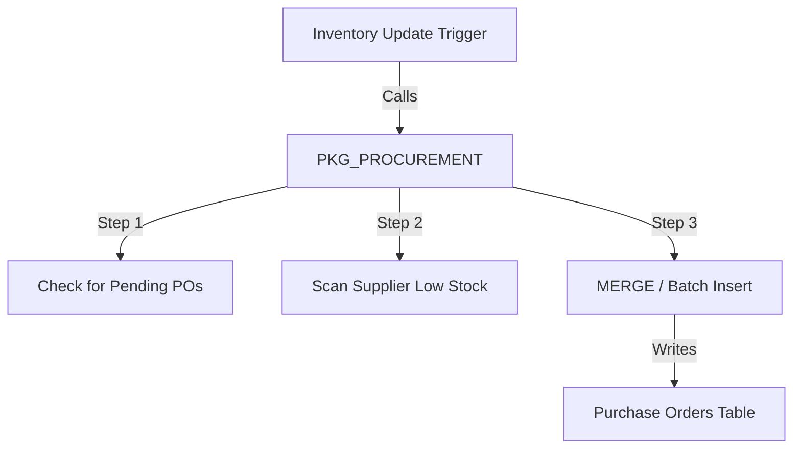

# Research: Architecture - Maxxbrands ERP

High-level architecture patterns for a resilient Oracle-based procurement system.

## 1. Procurement Control Layer

To handle the more complex "Batched" and "Idempotent" requirements, we will introduce a **Control Package** architecture.

### Components
- **`PKG_PROCUREMENT`**: Houses all reorder logic. This allows us to unit test the logic independently of the trigger firing mechanism.
- **Statement-Level Compound Triggers**: Used to capture multiple inventory updates in a single statement and run the batch reorder logic once at the end.

## 2. Event-Driven Audit Layer

The audit system will shift from simple logging to a **Unified Event Model**.

### Table: `audit_logs`
- **Current**: Logs Sale ID and Status.
- **Improved**: Will log `related_entity`, `action_type`, and a JSON-structured `details` field (using Oracle 23ai's native JSON support) to capture complex state changes.

## 3. Security & Authority Delegation

### Dynamic Role Resolution
- Instead of checking for specific `employee_id` values, the system will check for `role_type` (e.g., 'STORE_MGR', 'WHS_MGR').
- This ensures that if the personnel change, the system automation remains functional as long as the roles are assigned correctly.

---

*Verified: April 2026*
